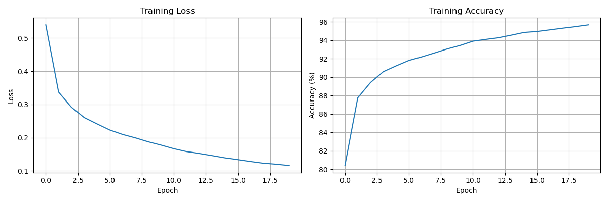
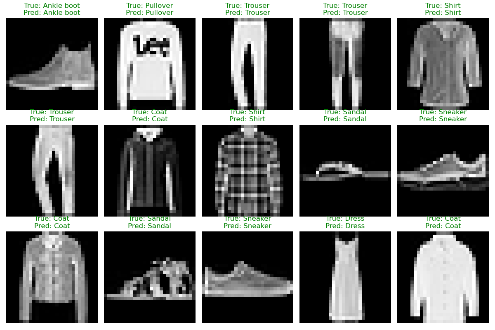

# fashion-mnist-cnn-pytorch
PyTorch implementation of CNN for image classification on Fashion-MNIST dataset

This repository serves as a foundational demonstration of core deep learning workflows in PyTorch, including custom model architectures, data loading, training loops, and evaluation metrics.

## Features
* **Custom CNN Architecture:** Includes convolutional blocks, max pooling, dropout for regularization, and fully connected layers.
* **Complete Training Pipeline:** Tracks and visualizes training loss and accuracy over epochs.
* **Detailed Evaluation:** Calculates overall test accuracy and **per-class accuracy**.
* **Visualization:** Automatically generates side-by-side comparisons of true vs. predicted labels.

## Model Summary
The CNN consists of:
- 3 convolutional layers
- max-pooling after each convolution block
- dropout layers for regularization
- 2 fully connected layers for classification

Input image size: `1 x 28 x 28`  
Output classes: `10`

## Repository Structure
```text
|-- data/                   # Dataset downloads here automatically
|-- models/                 # Saved .pth weights and output graphs
`-- scripts/
    |-- model.py            # The FashionCNN PyTorch architecture
    |-- train.py            # Training loop and loss visualization
    `-- test.py             # Evaluation and prediction visualization
```

## How to Run

1. Install requirements:
```bash
pip install -r requirements.txt
```

2. Train the model:
```bash
cd scripts
python train.py
```

3. Test the model:
```bash
python test.py
```

## Result
Here are the training curves showing the model's loss decreasing and accuracy improving over 20 epochs:



Here is the testing prediction visualization:


